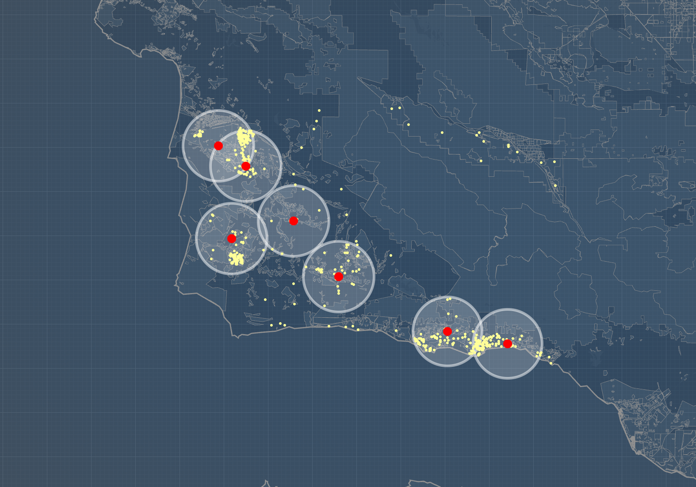
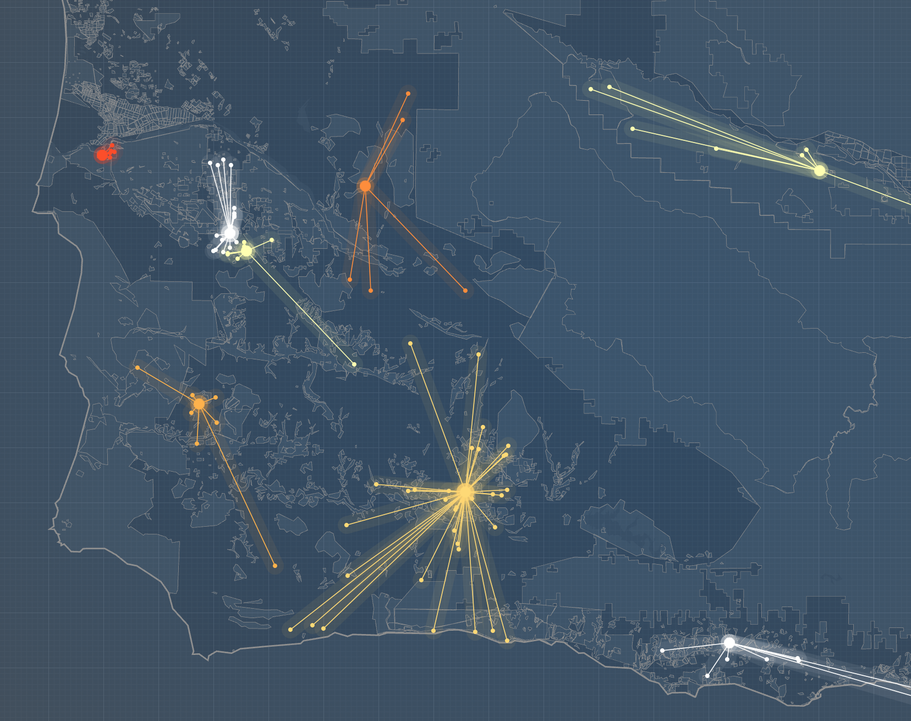

<b>Arogi MCLP and P-Median Demo Quickstart</b>

*Prerequisites*  

 1. Install Docker. Their webpage has [instructions](https://docs.docker.com/engine/installation/).

 2. In Windows and OS X, launch the Docker Quickstart Terminal. Linux uses the standard Terminal.

 3. Make a local copy of arogi-demos. Type:  
    `git clone https://github.com/arogi/arogi-demos.git`

*Getting Started*

 1. Type: `docker pull arogi/arogi-demos`  
    to grab the latest Arogi Docker image.

 2. Type: `docker run -it -p 80:80 -d -v ~/repos/arogi-demos/:/var/www/html arogi/arogi-demos`  
    In that statement, replace `~/repos/arogi-demos/` with the pathname to your local repository.

 3. Open a web browser and enter the following into the address bar:  
     On OS X and Windows, enter `192.168.99.100`. On Linux, enter `localhost`  

Screenshots:  
MCLP
  
P-Median  
  
